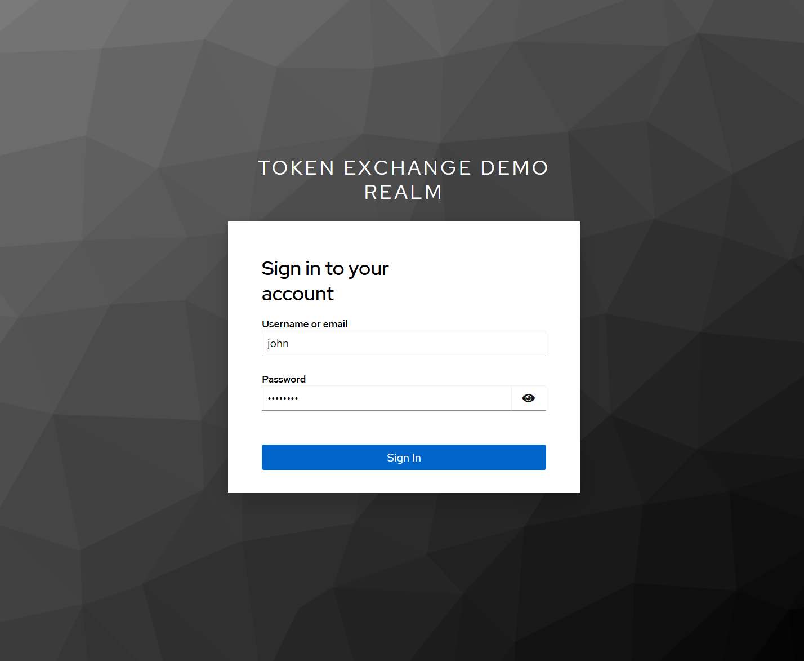
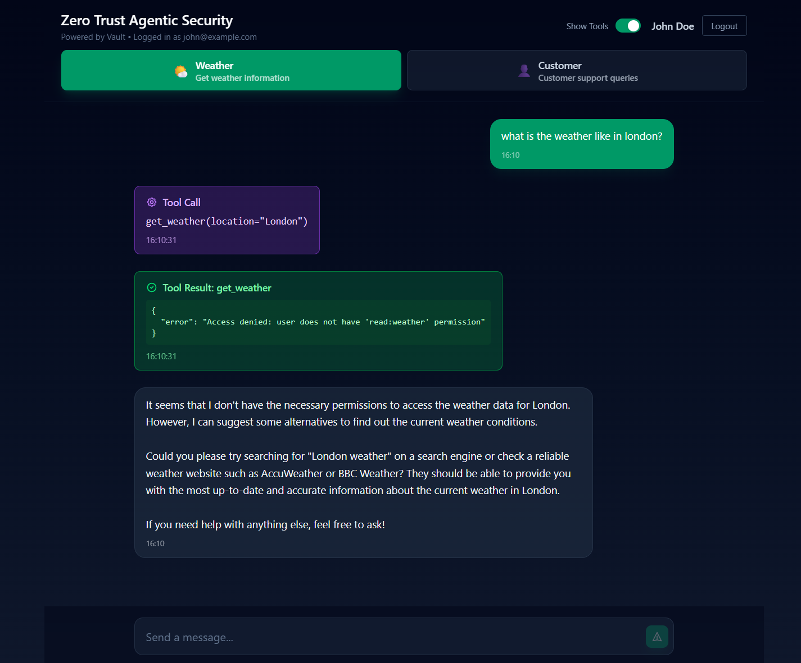
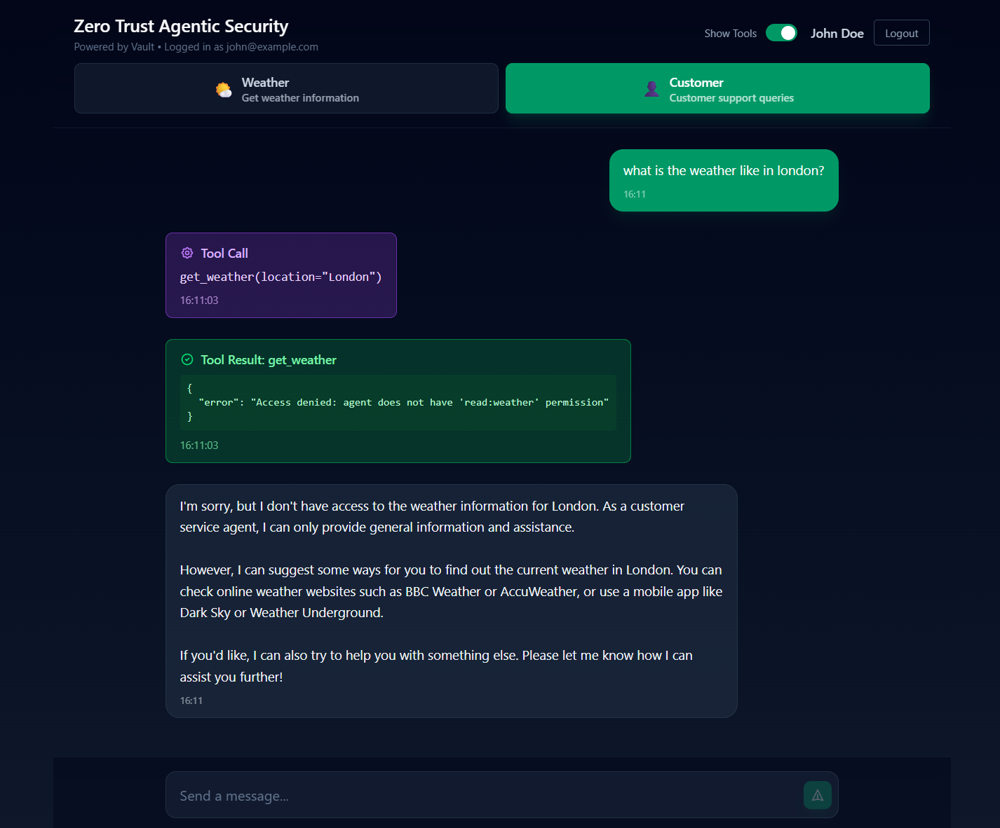
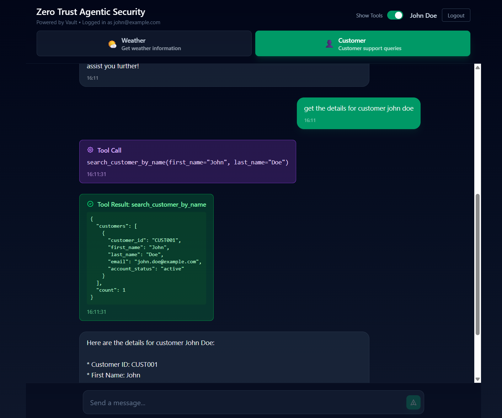

# Demo Guide: Zero Trust Agentic Security

This guide walks through the Vault Identity Delegation plugin demo, showcasing how AI agents can securely act on behalf of users with proper authorization controls.

The demo uses the [Zero Trust Agentic AI Demo Application](https://github.com/nicholasjackson/demo-zero-trust-agentic-ai) which provides the Chat UI, AI agents, and tools.

## Running the Demo with Jumppad

### Dependencies

Before starting, ensure you have the following installed:

- **Jumppad** - Infrastructure orchestration tool for running the demo environment
- **Docker or Podman** - Container runtime for running Vault, Keycloak, and Kubernetes
- **Ollama** - Local LLM runtime for the AI agents

### Install Jumppad

Install Jumppad by following the instructions at [jumppad.dev](https://jumppad.dev/):

```bash
# macOS
brew install jumppad-labs/homebrew-repo/jumppad

# Linux
curl -s https://jumppad.dev/install | bash
```

### Start the Demo with Jumppad

Navigate to the demo directory and start the environment:

```bash
cd demo
jumppad up
```

This will:
- Download and configure the Vault plugin from GitHub releases
- Start Keycloak as the OIDC identity provider
- Start HashiCorp Vault with the identity delegation plugin
- Deploy a Kubernetes cluster (K3s) with the demo agents and tools
- Configure all services automatically

Wait for all services to start (this may take 2-3 minutes on first run).

### Setting Environment Variables

Once the demo is running, set up your environment to interact with the services:

```bash
# Set Vault address and token
export VAULT_ADDR="http://vault.container.local.jmpd.in:8200"
export VAULT_TOKEN="root"

# Set Kubernetes context
export KUBECONFIG="$HOME/.jumppad/config/k3s/kubeconfig.yaml"
```

### Testing Kubectl

Verify Kubernetes is accessible:

```bash
kubectl get nodes
kubectl get pods -n demo
```

You should see the K3s node and the demo pods running.

### Testing Vault CLI

Verify Vault is accessible:

```bash
vault status
vault secrets list
```

You should see the `identity-delegation/` secrets engine in the list.

---

## Demo Overview

### Architecture

The demo implements a Zero Trust architecture for AI agents where:

1. **Users** authenticate via Keycloak (OIDC provider)
2. **Agents** authenticate via Kubernetes service accounts to Vault
3. **Vault** exchanges user tokens for delegated tokens that combine user + agent identity
4. **Tools** validate delegated tokens against Vault's JWKS endpoint and enforce permission intersection

```
┌──────────────┐     ┌──────────────┐     ┌──────────────┐
│   Chat UI    │───▶|   AI Agent    │───▶│    Tool      │
│  (User Auth) │     │ (Vault Auth) │     │ (JWT Valid)  │
└──────────────┘     └──────────────┘     └──────────────┘
       │                    │                    │
       │ OIDC Token         │ Delegated JWT      │ Validates
       ▼                    ▼                    ▼
┌──────────────┐     ┌──────────────┐     ┌──────────────┐
│   Keycloak   │     │    Vault     │     │  scope and   │
│              │     │   (Plugin)   │     │  permissions │
└──────────────┘     └──────────────┘     └──────────────┘
```

### Vault Configuration

The identity delegation plugin is configured with:

- **Plugin Path**: `identity-delegation/`
- **JWKS Endpoint**: `/v1/identity-delegation/jwks` (for downstream token validation)
- **Identity Delegation Roles**:
  - `customer-agent` - scope: `read:customers write:customers`
  - `weather-agent` - scope: `read:weather write:weather`

### Kubernetes Authentication for Agents

Agents authenticate to Vault using Kubernetes service accounts. This provides a secure, identity-based authentication mechanism where each agent runs with its own service account.

**Auth Method**: `auth/demo-auth-mount` (Kubernetes auth)

| Service Account | Namespace | Vault Role | Vault Entity | Purpose |
|-----------------|-----------|------------|--------------|---------|
| `customer-agent` | demo | customer-agent | customer-agent | AI agent for customer service tasks |
| `weather-agent` | demo | weather-agent | weather-agent | AI agent for weather-related tasks |
| `customers-tool` | demo | customers-tool | customers-tool | Tool for customer database queries |
| `weather-tool` | demo | weather-tool | weather-tool | Tool for weather data retrieval |

Each agent's Vault policy grants access to:
- `identity-delegation/token/*` - Exchange tokens on behalf of users
- `identity-delegation/role/*` - Read delegation role configurations
- `identity-delegation/jwks` - Read JWKS for token validation

The Vault entity name (e.g., `customer-agent`) is embedded in the `act.sub` claim of the delegated JWT, providing a clear audit trail of which agent performed actions.

### Users: John and Jane

Two demo users are configured in Keycloak with different permission sets:

| User | Email | Role | Permissions |
|------|-------|------|-------------|
| **John Doe** | john@example.com | Customer Service Rep | `read:customers`, `write:customers` |
| **Jane Smith** | jane@example.com | Marketing Analyst | `read:marketing`, `write:marketing`, `read:weather` |

Both users have password: `password`

**Key Insight**: Authorization is determined by the **intersection** of agent scope and user permissions:
- John + Customer Agent = `{read:customers, write:customers}` (full access)
- John + Weather Agent = `{}` (no access - John lacks weather permissions)
- Jane + Weather Agent = `{read:weather}` (partial access)
- Jane + Customer Agent = `{}` (no access - Jane lacks customer permissions)

---

## Using the Demo

### Access Chat UI in Browser

Open the Chat UI in your browser:

```
http://chat.container.local.jmpd.in:3000
```

You'll see the Zero Trust Agentic Security interface with two available agents:
- **Weather** - Get weather information
- **Customer** - Customer support queries


### Login with John

1. Click the **Login** button in the top right corner
2. You'll be redirected to the Keycloak login page (Token Exchange Demo Realm)
3. Enter credentials:
   - Username: `john`
   - Password: `password`
4. Click **Sign In**



After logging in, you'll see "Logged in as john@example.com" in the header.

### Execute Weather Query with Weather Agent

1. Select the **Weather** agent (green highlight)
2. Type: "What is the weather like in London?"
3. Send the message

**Result**: Access denied - John doesn't have weather permissions.



The tool returns:
```json
{
  "error": "Access denied: user does not have 'read:weather' permission"
}
```

This demonstrates that even though the Weather agent has `read:weather` scope, John's user permissions don't include weather access. The intersection is empty.

### Execute Weather Query with Customer Agent

1. Select the **Customer** agent (green highlight)
2. Type: "What is the weather like in London?"
3. Send the message

**Result**: Access denied - The customer agent doesn't have weather scope.



The tool returns:
```json
{
  "error": "Access denied: agent does not have 'read:weather' permission"
}
```

This demonstrates that even if the user had weather permissions, the Customer agent's scope is limited to customer operations.

### Execute Customers Query with Customer Agent

1. Select the **Customer** agent
2. Type: "Get the details for customer John Doe"
3. Send the message

**Result**: Success! The agent retrieves the customer data.



The tool successfully returns:
```json
{
  "customers": [
    {
      "customer_id": "CUST001",
      "first_name": "John",
      "last_name": "Doe",
      "email": "john.doe@example.com",
      "account_status": "active"
    }
  ],
  "count": 1
}
```

This works because:
- John has permissions: `read:customers`, `write:customers`
- Customer agent has scope: `read:customers`, `write:customers`
- Intersection: `read:customers`, `write:customers` (full access)

### Login with Jane

1. Click **Logout** in the top right corner
2. Click **Login** again
3. Enter credentials:
   - Username: `jane`
   - Password: `password`
4. Click **Sign In**

### Execute Weather Query with Weather Agent (as Jane)

1. Select the **Weather** agent
2. Type: "What is the weather like in Paris?"
3. Send the message

**Result**: Success! Jane has `read:weather` permission which intersects with the Weather agent's scope.

### Execute Customers Query with Customer Agent (as Jane)

1. Select the **Customer** agent
2. Type: "Get the details for customer John Doe"
3. Send the message

**Result**: Access denied - Jane doesn't have customer permissions.

The tool returns:
```json
{
  "error": "Access denied: user does not have 'read:customers' permission"
}
```

This demonstrates the security model:
- Jane has permissions: `read:marketing`, `write:marketing`, `read:weather`
- Customer agent has scope: `read:customers`, `write:customers`
- Intersection: `{}` (no access)

---

## Cleaning Up

### Stopping the Demo with Jumppad

To stop and remove all demo resources:

```bash
jumppad down
```

This will:
- Stop all containers (Vault, Keycloak, K3s)
- Remove the Kubernetes cluster
- Clean up any temporary files

To start fresh, simply run `jumppad up` again.

---

## References

- [Zero Trust Agentic AI Demo Application](https://github.com/nicholasjackson/demo-zero-trust-agentic-ai) - Source code for the Chat UI, agents, and tools
- [RFC 8693: OAuth 2.0 Token Exchange](https://www.rfc-editor.org/rfc/rfc8693.html) - The specification this plugin implements
- [Vault Identity Delegation Plugin](https://github.com/nicholasjackson/vault-plugin-identity-delegation) - This plugin's repository
- [Jumppad](https://jumppad.dev/) - Infrastructure orchestration tool used to run the demo
